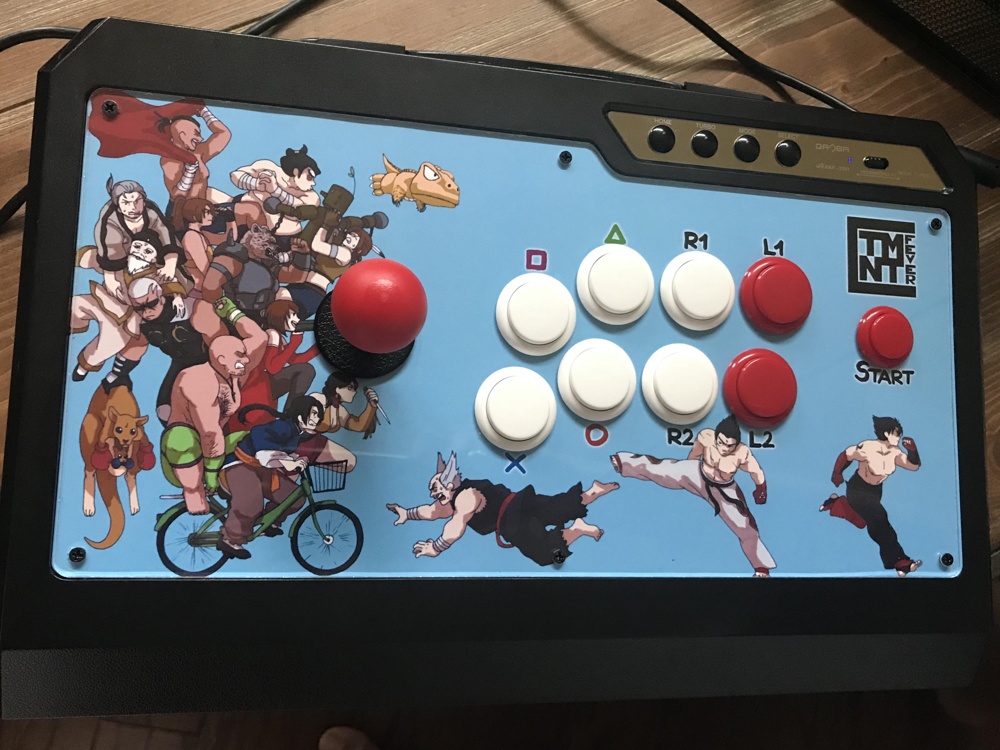
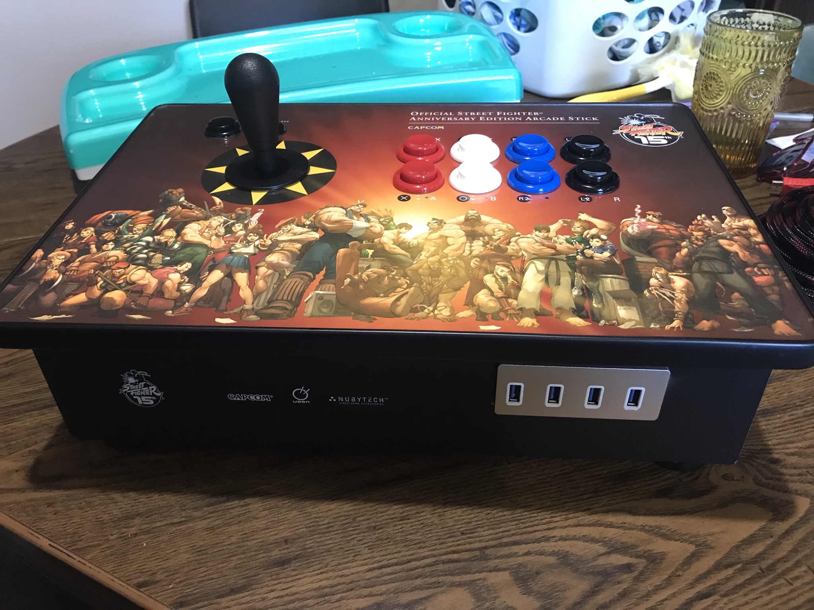

# TMNTfever.github.io
Website for TMNTfever

<!DOCTYPE html>
<html lang="en">

<!-- Head -->
<head>
  <meta http-equiv="Content-Type" content="text/html; charset=utf-8">
  <meta name="viewport" content="width=device-width, initial-scale=1, shrink-to-fit=no">
  <meta name="description" content="A home for what I love.">
  <meta name="author" content="J.C. Reyes">

  <title>TMNTfever</title>

  <link href="src/bootstrap/css/bootstrap.min.css" rel="stylesheet">
  <link href="css/index.css" rel="stylesheet">
  
  
  
  
</head>

<!-- Body -->
<body style="background-color:#212529">
<!-- Wrapper -->

  <!-- Sidebar -->
  

    

      
    

    
    

      <a href="#" onclick="return toggle('pg0')" class="list-group-item list-group-item-action bg-dark text-light"> Home</a>
      <a href="#" onclick="return toggle('pg1')" class="list-group-item list-group-item-action bg-dark text-light"> Ukulele</a>
      <a href="#" onclick="return toggle('pg2')" class="list-group-item list-group-item-action bg-dark text-light"> Fightstick</a>
      <a href="#" onclick="return toggle('pg3')" class="list-group-item list-group-item-action bg-dark text-light"> Resume</a>
      <a href="#" onclick="return toggle('pg4')" class="list-group-item list-group-item-action bg-dark text-light"> Contact</a>
    

  

  <!-- /#sidebar-wrapper -->

  <!-- Page Content -->
  

      <!-- Home Page -->
    

      <header>
        <h1 class="mt-2">HOME</h1>
      </header>
      
Welcome to my website. I wasn't satisfied with what other websites were providing me in terms of storing ukulele chord sheets, so I wanted to make a space where I could customize the functionality. Enjoy and please credit me if you use my arrangements.

      <iframe width="650" height="38" style="border: none;" src="https://free.timeanddate.com/clock/i8hv56om/n179/fn8/fs16/fcffdf00/tc343a40/pct/ftb/bas2/bacfff/pa8/tt0/th1/ta1"></iframe> 
      <iframe width="650" height="450" style="border: none;" src="https://embed.windy.com/embed2.html?lat=28.206&lon=-80.687&detailLat=28.206&detailLon=-80.687&width=650&height=450&zoom=5&level=surface&overlay=wind&product=ecmwf&menu=&message=&marker=&calendar=now&pressure=&type=map&location=coordinates&detail=&metricWind=default&metricTemp=default&radarRange=-1"></iframe> 
      <iframe width="650" height="366" style="border: none;" src="https://www.youtube.com/embed/videoseries?list=PLDHLbb1WuxUBf4p4hi6smedrilPEYRcMg" title="YouTube video player" allow="accelerometer; autoplay; clipboard-write; encrypted-media; gyroscope; picture-in-picture" allowfullscreen></iframe>
    

    
    <!-- Ukulele Page -->
    

      <header>
        <h1 class="mt-2">UKULELE</h1>
      </header>
      
      <table style="width: 100%;" class="table table-dark table-striped table-hover sortable">
        <thead>
          <tr id="tableHeader">
          </tr>
        </thead>
        <tbody id="tableBody">
        </tbody>
      </table>
    

    
    <!-- Fightstick Page -->
    

      <header>
        <h1 class="mt-2">FIGHTSTICK</h1>
      </header>
      
      <h3>Qanba Q4RAF - Tekken</h3>
      
      
This was a simple mod; just an art, lever, and button swap. The art was created by <a href="https://twitter.com/umasukesankana">Umasuke Sankana</a>, and used with his permission. I also drew in Gon myself matching his artstyle, since I felt I needed to fill in that negative space a bit. I wanted to draw Jun in there too, but couldn't think of a creative way to add her in without being covered by the lever, and without just awkwardly floating in mid-air.

      
This fightstick was modded around the launch of Tekken 7 on PC, which explains the characters being left behind; there was no DLC released yet for T7. The lever is a Sanwa JLF with a bat-top (hard to see from this angle). I also replaced the shaft with a Phreakmods Link for easy storage when travelling. The buttons are all Sanwa as well. All of these parts were purchased from <a href="http://paradisearcadeshop.com">Paradise Arcade Shop</a>.

       
      
      <h3>Street Fighter 15th Anniversary - Pi Arcade</h3>
      
      
A much more involved project. This is the first fightstick that I bought with my own money. The original PCB was compatible with only PS2 and Xbox, so I replaced it with a Zero Delay PCB. The parts were all soldered and glued in, so I had to use some elbow greese to remove them. I kept the original art (which is beautiful), but it was such a pain removing it to swap out the lever. I'm just lucky the art wasn't damaged since this was fighstick was stored in a hot garage for over a decade.

      
The buttons were worn out and getting stuck, and the stick springs had become too loose. I replaced all of the buttons and lever with Suzo-Happ parts, purchased through <a href="https://focusattack.com">Focus Attack</a>. And since I gutted the original PS2/Xbox components, I repurposed the Xbox memory card slot to house a USB hub. This hub plugs into a battery-powered Raspberry Pi 3B, which the fightstick is also connected to.

      
There are two outputs from the chastise, one is an HDMI and the other is USB. Plugging in the USB to PC, you can use the fightstick to play games normally. Plugging in the HDMI to a TV and turning on the Raspberry Pi will turn the box into a portable arcade machine, with up to 4 players. And one last QOL improvement was adding some soft-grip material to the bottom and removing the rubber feet. Now it's much more comfortable to use on my lap.

       
    
      <h3>Etokki Omni - Black and Gold</h3>
      
Coming soon.

       
    

    
    <!-- Resume Page -->
    

      <header>
        <h1 class="mt-2">JULIAN-CHRIS D. REYES</h1>
      </header>
      
      

        
Item 1

        
Item 2

        
Item 3

        
Item 4

      

      
      
I am a Sr. Principal Software Quality Engineer looking to support cross-discipline in the Aeronautical industry. As a programmer, I bring a deep level of understanding software development. I also bring automation expertise which has improved the productivity and consistency of several quality organizations across multiple flight programs.

      <h3>Work Experience</h3>
      

      <h3>Education</h3>
      

      <h3>Security Clearance</h3>
      

      <h3>Technical Skills</h3>
      

    

    
    <!-- Contact Page -->
    

      <header>
        <h1 class="mt-2">CONTACT</h1>
      </header> 
      
       
      
<a href="tel:7602173491"> (760) 217-3491</a>

      
<a href="mailto:julianchris.reyes@gmail.com"> julianchris.reyes@gmail.com</a>

      
<a href="https://www.youtube.com/frostyminiwheats"> https://www.youtube.com/frostyminiwheats</a>

      
<a href="https://twitter.com/tmntfever"> https://www.twitter.com/TMNTfever</a>

      
<a href="https://www.facebook.com/julianchris.reyes/"> https://www.facebook.com/julianchris.reyes/</a>

      
<a href="https://reddit.com/u/tmntfever"> https://www.reddit.com/u/tmntfever</a>

      
<a href="https://steamcommunity.com/id/tmntfever/"> https://steamcommunity.com/id/tmntfever/</a>

      
<a href="#"> KaosMonkey#1365</a>

      
<a href="#"> JCR#1383</a>

    

    
    <!-- Sheet Page -->
    

      <header>
        <h1 class="mt-2">Song Title</h1>
      </header>
    

  

  <!-- /#page-content-wrapper -->

<!-- /#wrapper -->

<!-- Custom Scripts -->

</body>
</html>
